# How to get started for using IoT Hub REST API in Python

## About this sample
The sample project demonstrates how to get started for using IoT Hub REST API in Python.

The REST APIs for IoT Hub offer programmatic access to the device and messaging services, as well as the resource provder, in IoT Hub. You can access messaging services from within an IoT service running in Azure, or directly over the Internet from any application that can send an HTTP/HTTPS request and receive an HTTP/HTTPS response. You can visit the [IoT Hub REST API references](https://msdn.microsoft.com/en-us/library/azure/mt548492.aspx) on Microsoft Azure offical site to learn more about these APIs, requirements, parameters, request and response via HTTP methods.

In the sample project, it will show these steps below for helping us to get started.

1. Create an IoT Hub through Azure Portal.
2. Get the connection information from the settings on Azure portal.
3. A simple Python script shows how to create a device identity at the IoT Hub, list all registered device identities from IoT Hub.
4. A simple Python script shows how to send messages from the simulated device application to IoT Hub.


## Create an IoT Hub through Azure Portal
1. Log on to the [Azure Portal](https://portal.azure.com/).
2. In the navigation bar, click **New**, then click **Internet of Things**, select **Azure IoT Hub**.
    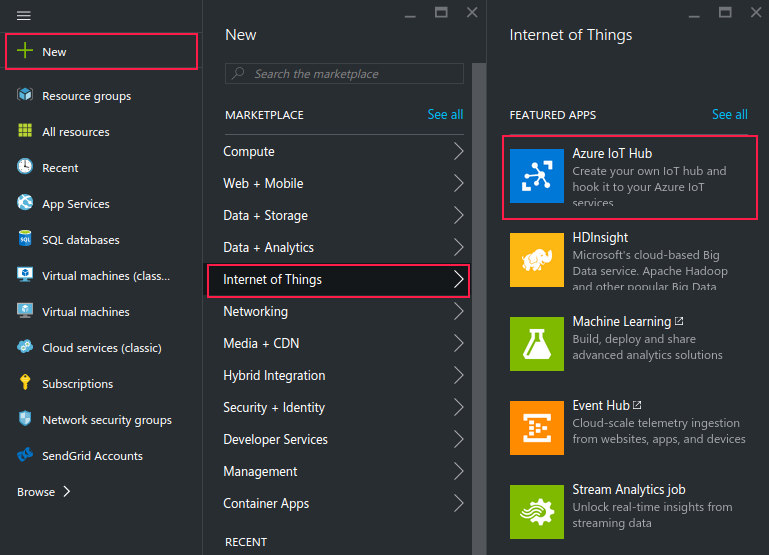
3. In the **New IoT Hub** blade, specify the desired configuration for the IoT Hub.
    - In the **Name** box, enter a name to identify your IoT hub. When the **Name** is validated, a green check mark appears in the **Name** box.
    - Change the **Pricing and scale tier** as desired. This tutorial does not require a specific tier.
    - In the **Resource group** box, create a new resource group, or select an existing one. For more information, please refer to [Using resource groups to manage your Azure resources](https://azure.microsoft.com/en-us/documentation/articles/resource-group-portal/).

        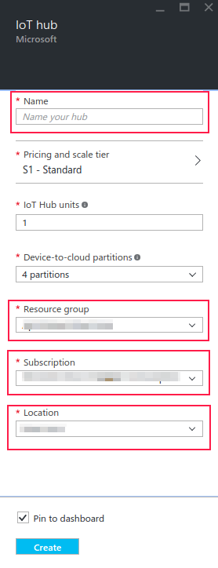
    - Use **Location** to specify the geographic location in which to host your IoT hub.
4. Once the new IoT hub options are configured, click **Create**. It can take a few minutes for the IoT hub to be created. To check the status, you can monitor the progress on the Startboard. Or, you can monitor your progress from the Notifications section.
5. The two figures below shown the progress on the Startboard.

    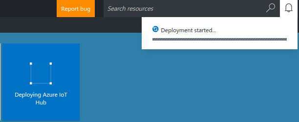


## Get the connection information
- Getting the IoT Hub **Hostname**

    Copy the IoT Hub **Hostname** at the dashboard.

    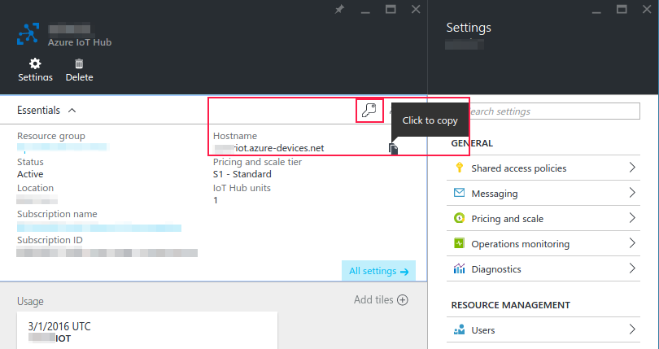

- Getting the **Shared access key** and **Connection string** of the policy

    Click the **Key** button to show the **Shared access policies**, then select one policy, then copy the **Shared access key** and **Connection string**.

    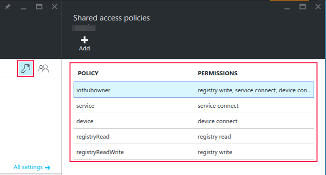

    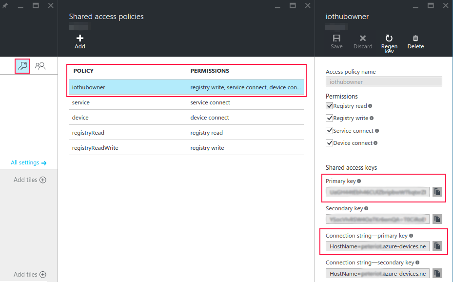

## Building the sample
You can use Eclipse with PyDev Plugin to import the sample project.
### Preparation
- Install the Python package **requests** via command pip install requests
- Download [Eclipse](https://eclipse.org/downloads/)
- Install PyDev plugin via Eclipse Marketplace, click **Help** -> **Eclipse Marketplace**, then input **PyDev** in the search box and enter, then click the **install** button and follow the tips to install until **Finish** and restart Eclipse.

    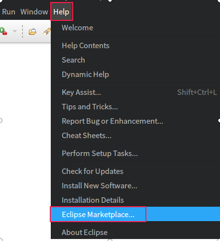

    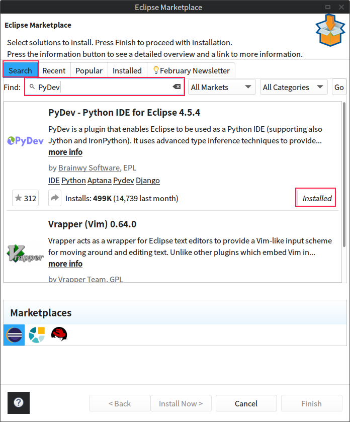

### Import the sample project
1. Open the Eclipse.
2. Click **File** -> **Import**.

    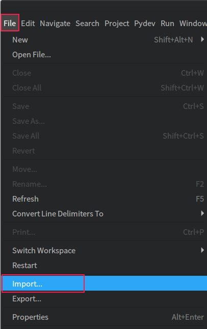

3. Select **General** -> **Existing Projects into Workspace**, then click **Next**.

    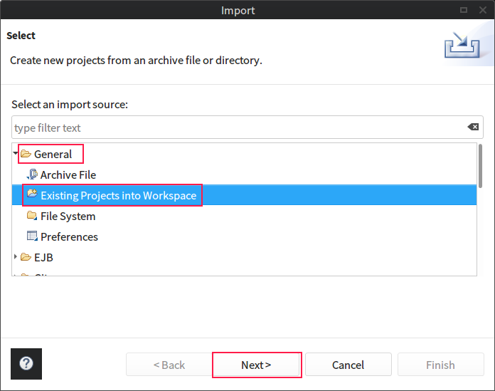

4. Select the sample project path via **Browse**, then click **Finish**.

    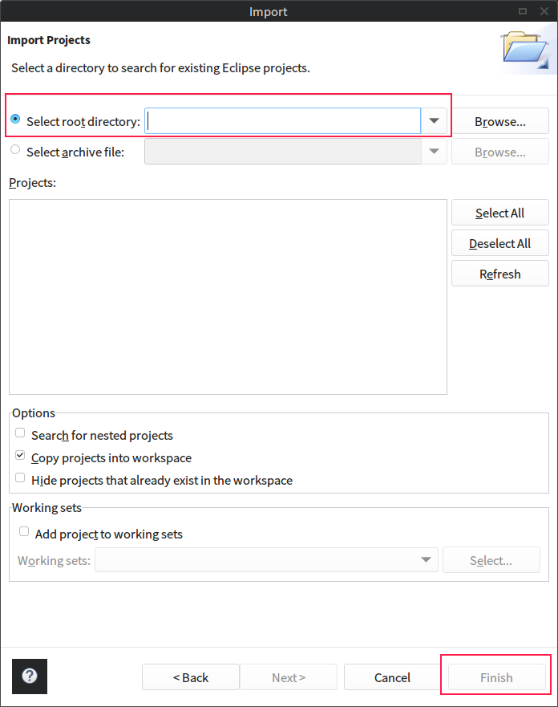

5. See the **PyDev Package Explorer**.

    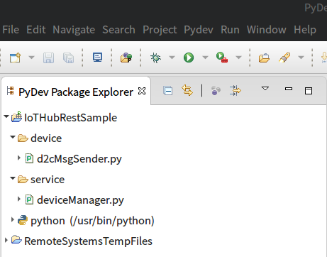

## Running the sample
There are two scripts separately at the **service** and **device** directoies.
- service/deviceManager.py: Using [Device Indentities REST APIs](https://msdn.microsoft.com/en-us/library/azure/mt548489.aspx) to create a new device identity, retrieve a device identity, and list device identities.
- device/d2cMsgSender.py: Using [Send device-to-cloud message](https://msdn.microsoft.com/en-US/library/azure/mt590784.aspx) API to send device-to-cloud message from the simulated device application to IoT Hub.

You can open the Python script on Eclipse, and click the right mouse button at the script window, then click the **Run As** -> **2 Python Run** to run the script, then see the result at the **Console** Window.

    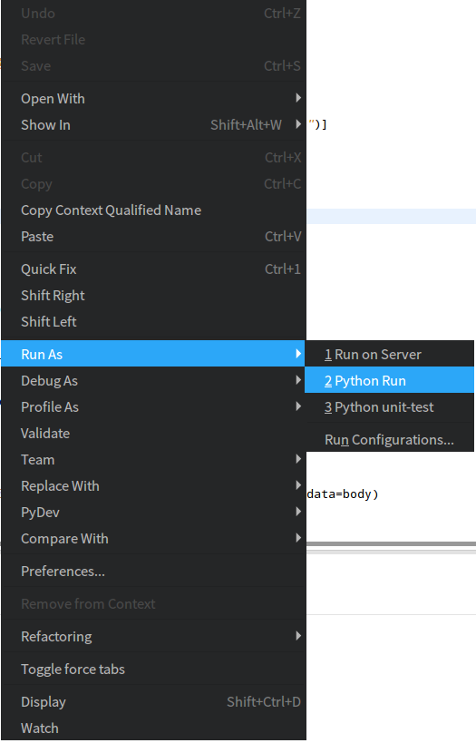

## Code sample running result
The results for running `service/deviceManager.py`:


1. The result for calling the function `createDeviceId(deviceId)`

    - Creating an non-existed device identity, the result as below.
    ```
    (u'{"deviceId":"iotdevice3","generationId":"635937464376399955","etag":"MA==","connectionState":"Disconnected","status":"enabled","statusReason":null,"connectionStateUpdatedTime":"0001-01-01T00:00:00","statusUpdatedTime":"0001-01-01T00:00:00","lastActivityTime":"0001-01-01T00:00:00","cloudToDeviceMessageCount":0,"authentication":{"symmetricKey":{"primaryKey":"PqZ70GzRIOv8Mfap31nzDjwqsRwt8X6VTLDUM48qDGk=","secondaryKey":"gZfLMBuwgNDOuYbJZNK8ZXLGCm5WJba4CVGvXBV/0qM="}}}', 200)
    ```
    - If trying to create an existed device identity, an error information will be shown.

    ```
    (u'{"Message":"ErrorCode:DeviceAlreadyExists;A device with ID \'iotdevice1\' is already registered.\r\nTracking Id:218b497e330b41119036553381cc63de-G:GatewayWorkerRole.11-B:1-P:8a500395-cf20-45f1-831b-e0a49c9bd5fa-TimeStamp:03/16/2016 17:26:37\r\nErrorCode:DeviceAlreadyExists"}', 409)
    ```

2. The result for calling the function `retrieveDeviceId(deviceId)`
    ```
    (u'{"deviceId":"iotdevice1","generationId":"635928930091746067","etag":"MA==","connectionState":"Disconnected","status":"enabled","statusReason":null,"connectionStateUpdatedTime":"2016-03-16T09:46:02.5862088","statusUpdatedTime":"0001-01-01T00:00:00","lastActivityTime":"2016-03-16T09:46:02.5862088","cloudToDeviceMessageCount":0,"authentication":{"symmetricKey":{"primaryKey":"F+x9Sg9zVZC+TWnrQ1vXm0sYH/SAtvv6Wa5WhWnHdQo=","secondaryKey":"vZaSU6/8Mah4Chu28Vzx07/Feqe1a2EeDeUNEo9EY10="}}}', 200)
    ```

3. The result for calling the function `listDeviceId()` list all registed device identities.
    ```
    (u'[{"deviceId":"iotdevice1","generationId":"635928930091746067","etag":"MA==","connectionState":"Disconnected","status":"enabled","statusReason":null,"connectionStateUpdatedTime":"2016-03-16T09:46:02.5862088","statusUpdatedTime":"0001-01-01T00:00:00","lastActivityTime":"2016-03-16T09:46:02.5862088","cloudToDeviceMessageCount":0,"authentication":{"symmetricKey":{"primaryKey":"F+x9Sg9zVZC+TWnrQ1vXm0sYH/SAtvv6Wa5WhWnHdQo=","secondaryKey":"vZaSU6/8Mah4Chu28Vzx07/Feqe1a2EeDeUNEo9EY10="}}}]', 200)
    ```

The result for running `device/d2cMsgSender.py`, it includes the empty content and status code 204 from the response if message is sent successfully:
```
(u'', 204)
```
